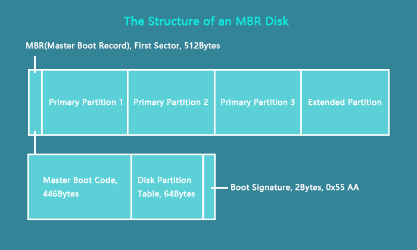
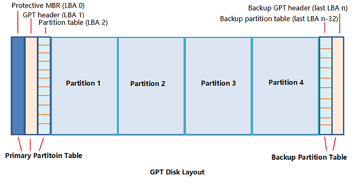
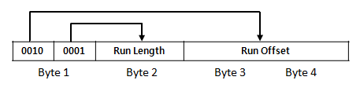

# File system

## MBR

Master Boot Record<br />


```
$ cd ./mbr
$ make
$ mbr_parser {mbr_image_file}
```

## GPT

GUID Partition Table<br />


```
$ cd ./gpt
$ make
$ gpt_parser {gpt_image_file}
```

## FAT32

How FAT32 works<br />


```
$ cd ./fat32
$ make
$ fat32_parser {fat32_image_file} {starting_cluster_number}
```

## NTFS

NTFS runlist<br />


```
$ cd ./ntfs
$ make
$ ntfs_parser {ntfs_image_file}
```